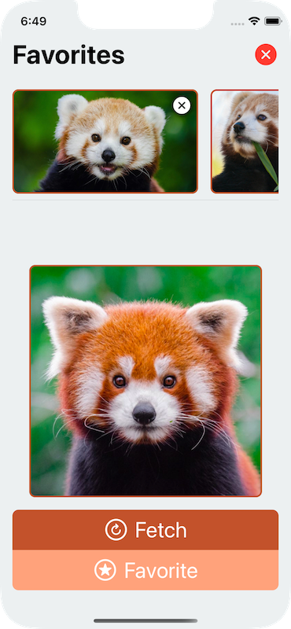

# A fork of @mergesort's MVCS demo, but with ViewControllers

The purpose of this fork is to show how the app looks like if we add
[ViewController](https://github.com/ZeeZide/ViewController)'s to the
[MVCS](https://build.ms/2022/06/22/model-view-controller-store) mix
(the "VC" in M**VC**S 😉).

A key feature of [@mergesort](https://twitter.com/mergesort)'s setup is the
[Boutique](https://github.com/mergesort/Boutique)
[`Store`](https://github.com/mergesort/Boutique#store),
which makes it really easy to persist 
[`Codable`](https://developer.apple.com/documentation/swift/codable)
objects.
Kinda like a "Nano SwiftData".

Links:
- The original [MVCS demo project](https://github.com/mergesort/MVCS) on GitHub
- Mergesort's blog entry describing his
  [MVCS](https://build.ms/2022/06/22/model-view-controller-store/)
  architecture.
- My blog entry about using 
  [MVC ViewController](http://www.alwaysrightinstitute.com/viewcontroller/)'s
  with SwiftUI


## "Controller" Differences

In @mergesort's 
[MVCS](https://build.ms/2022/06/22/model-view-controller-store)
setup, the "Controller" object is an arbitrary
[`ObservableObject`](https://developer.apple.com/documentation/combine/observableobject)
that performs common operations on behalf of SwiftUI Views,
and latches on to the 
[`Store`](https://github.com/mergesort/Boutique#store)
for persistence.

The original demo has the
[`ImagesController`](https://github.com/mergesort/MVCS/blob/main/MVCS-Demo/Images/ImagesController.swift)
example which is instantiated (twice!) and used by both Views.

A [ViewController](https://github.com/ZeeZide/ViewController)
is a very specific kind of a controller in Apple's
["MVC"](https://developer.apple.com/library/archive/documentation/General/Conceptual/DevPedia-CocoaCore/MVC.html)
(really more like MWC),
that deals with the needs of a specific View.
Described well in
[The Role of View Controllers](https://developer.apple.com/library/archive/featuredarticles/ViewControllerPGforiPhoneOS/index.html#/apple_ref/doc/uid/TP40007457-CH2-SW1).

I think the example is a good usecase for 
[ViewController](https://github.com/ZeeZide/ViewController)'s,
as it has two distinct screen sections that manage certain aspects of
the application (even though it doesn't have navigation in the traditional way).

## Injecting "more" MVC into MVCS

While one can use 
[MVCS](https://build.ms/2022/06/22/model-view-controller-store)
with the more general controllers,
and
[ViewController](https://github.com/ZeeZide/ViewController)
without the specific
[`Store`](https://github.com/mergesort/Boutique#store),
they actuall supplement each other quite well!

[ViewController](https://github.com/ZeeZide/ViewController)
exists to structure the `View` and presentation setup 
using the known VC pattern,
but doesn't do anything about model persistence.

[Boutique](https://github.com/mergesort/Boutique)
adds an easy to use persistence framework for simpler setups.

Since the [Boutique Store](https://github.com/mergesort/Boutique#store)
attaches to arbitrary 
[`ObservableObject`](https://developer.apple.com/documentation/combine/observableobject)'s
using the
[`@Stored`](https://github.com/mergesort/Boutique#the-magic-of-stored)
property wrapper,
it works w/ a 
[`ViewController`](http://www.alwaysrightinstitute.com/viewcontroller/#viewcontroller)
out of the box!

## How does it look like

Note: I didn't change of the original layout or functionality, just reordered
      things to fit the VC setup.

<p align="center">
  
</p>

The app has two screen sections:
- The
  `FavoritesCarousel`
  on the top. It shows the Panda's that have been saved to the store,
  and can remove them from the store.
- The
  `RedPandaCard`
  which can fetch new Panda's from the Interwebs and save them to the store.

Both of which we turn into
[ViewController](https://github.com/ZeeZide/ViewController)'s.
And we add another one, `Main`, which controls the scene view
(i.e. what has been the `ContentView` before).

The `Main` VC is attached directly in the scene:
```swift
@main
struct MVCSDemoApp: App {
  
  var body: some Scene {
    WindowGroup {
      MainViewController(Main())
    }
  }
}
```
And looks like this:
```swift
class Main: ViewController {
  let carouselFocusController = ScrollFocusController<String>()
  let carousel  = FavoritesCarousel()
  lazy var card = RedPandaCard(focusController: carouselFocusController)
  
  var view: some View {
    VStack(spacing: 0.0) {
      carousel
        .controlledContentView // essentially the "presentInline"
        .environmentObject(carouselFocusController)
        .padding(.bottom, 8.0)

        Divider()

        Spacer()

      card
        .controlledContentView
    }
    .padding(.horizontal, 16.0)
    .background(Color.palette.background)
  }
}
```

> Note how the `View` (like in UIKit) becomes owned by the `ViewController`,
> i.e. the "other way around" to what people often come up with in SwiftUI.
> That is the key premise in our
> [ViewController](https://github.com/ZeeZide/ViewController)
> setup, regardless whether it is done using the micro framework or using
> plain ObservableObject's.

The main controller has two child view controllers,
which are added as contained controllers.

Let's have a look at the `FavoritesCarousel`. Before it was a `View`,
not it is a `ViewController`, which owns the nested View:
```swift
class FavoritesCarousel: ViewController {

  @Stored(in: .imagesStore) var images

  @Published private var animation: Animation? = nil

  init() {
    ...
        self.animation = .easeInOut(duration: 0.35)
  }

  private func removeImage(image: RemoteImage) {
    Task { try await self.$images.remove(image) }
  }
  private func clearAllImages() {
    Task { try await self.$images.removeAll() }
  }
  
  var view: some View {
    VStack {
      HStack {
        Text("Favorites")
          .bold()
        ...
        Button(action: clearAllImages) {
          Image(systemName: "xmark.circle.fill")
          ...
        }
      }
      if images.isEmpty { ... }
      else {
        HStack {
          CarouselView(items: images.sorted(by: { $0.createdAt > $1.createdAt })) { 
            image in
            
            ZStack(alignment: .topTrailing) {
              RemoteImageView(image: image)
                ..
              Button(action: { self.removeImage(image: image) }) {
                Image(systemName: "xmark.circle.fill")
                ..
              }
            }
          }
        }
      }
    }
  }
}
```

The first things to note is that we have the
```swift
@Stored(in: .imagesStore) var images
```
This is the "magic" coming in from
[Boutique](https://github.com/mergesort/Boutique).
It sets up the store which auto-persists and auto-restores.
If any VC or View in the stack modifies the store, the VC will update
accordingly.

The second thing to note it the `@Published var animation`.
That was an `@State` of a `View` before. In our VC setup, state generally does
not belong into View's.

Then there comes an `init`, another important part in the VC setup.
It makes the `task` (aka `onAppear`) modifier superfluous.
Because ViewController's are setup explicitly and have identity (they are
objects in the presentation hierarchy), the flow is always clear and 
initialization can be done when necessary.

What follows are the `removeImage` and `clearAllImages` actions that
are hooked up directly to the `Button`s and modify the store.
Also note that proper encapsulation is in play, i.e. all the methods of a VC
can usually be marked `private`.

And finally the `view` of the `ViewController`.
Nothing really special about it. 
The View doesn't need to be done inline. Like its common in UIKit,
more complex Views can be moved outside of the VC class.

The `RedPandaCard` `ViewController` works the same. Feel free to have a look
in the sample.


## Nested Controllers

Note that even with VC's, a more general controller like the
[`ImagesController`](https://github.com/mergesort/MVCS/blob/main/MVCS-Demo/Images/ImagesController.swift)
can still be used. 
For further structuring of the application (they are often called a "Service"
in MVC setups).

To hookup a VC with another controller (or any other ObservableObject),
[`willChange(with:)`](https://github.com/ZeeZide/ViewController/blob/develop/Sources/ViewController/ViewController/Subscriptions.swift)
is available. It could looks like this:
```swift
class FavoritesCarousel: ViewController {
  
  let imagesControllers = ImagesController()
  
  init() {
    willChange(with: imagesController)
  }
}
```
This makes the view refresh if the nested controller changes.


## Closing Notes

[ViewController](https://github.com/ZeeZide/ViewController)
diverges from the controller idea in
[MVCS](https://build.ms/2022/06/22/model-view-controller-store).
Though IMO they go along really well and provide each other the cherry on 
top 🍒

Having a specific controller for views does provide some structure,
especially when it comes to (especially nested) navigation.
Though we need to revisit that with the NavigationStack changes coming in
SwiftUI 4 / iOS 16 😬

Have fun!


<hr/>

# Original Readme

<p align="center">
  
</p>

## Welcome to a demo of the Model View Controller Store architecture. If you'd like to familiarize yourself with Model View Controller Store you can read about the philosophy, along with a very technical walkthrough [in this post](https://build.ms/2022/06/22/model-view-controller-store/).

SwiftUI has never been granted a blessed architecture by Apple, and many developers have spent countless hours filling the gaps with their own ideas. The most common approach is to take the [MVVM](https://www.objc.io/issues/13-architecture/mvvm/) pattern and translate it to the needs of SwiftUI, which works well but has gaps exposed given SwiftUI's View-centric nature. Others have taken the path of integrating well thought out and powerful libraries such as [The Composable Architecture](https://github.com/pointfreeco/swift-composable-architecture) to have the tools to reason about your entire application, but come with a very high learning curve. 

Model View Controller Store is a rethinking of an architecture familiar to iOS developers [MVC](https://developer.apple.com/library/archive/documentation/General/Conceptual/DevPedia-CocoaCore/MVC.html), for SwiftUI. You can build apps across many platforms using this pattern, in fact the C from MVCS is inspired by Rails [Controllers](https://guides.rubyonrails.org/getting_started.html) rather than [ViewControllers](https://developer.apple.com/documentation/uikit/view_controllers), but in this demo we'll focus on SwiftUI. The Model and View require no changes to your mental model when you think about a Model or View in a SwiftUI app, but what's new is the concept of a `Store`. You can think the `Store` as your storage for your model objects, in SwiftUI this would be your [single source of truth](https://www.raywenderlich.com/11781349-understanding-data-flow-in-swiftui). The combination of MVC and a Store bound together by a simple API allows a developer to give their app a straightforward and well-defined data architecture, with no learning curve, to create an app that's incredibly easy to reason about.

The best way to explain Model View Controller Store is to show you what it is. The idea is so small that I'm convinced you can look at the code in this repo and know how it works almost immediately, there's actually very little to learn. Model View Controller Store doesn't require you to change your apps, and this demo app is powered by [Boutique](https://www.github.com/mergesort/Boutique), a library I've developed to provide a batteries-included `Store`. It requires no tricks to use, does *no behind the scenes magic*, and doesn't resort to shenanigans like runtime hacking to achieve a great developer experience. Boutique's Store is a dual-layered memory and disk cache which ***lets you build apps that update in real time with full offline storage with three lines of code and an incredibly simple API***. That may sound a bit fancy but all it means is that when you save an object into the `Store`, it also saves that object to disk. This persistence is powered under the hood by [Bodega](https://github.com/mergesort/Bodega), an actor-based library I've developed for saving data or Codable objects to disk.

## This repo is primarily oriented to sharing the Model View Controller Store demo code, if you'd like to learn more about how Model View Controller Store, Boutique, and Bodega work, please read the walkthrough [in this post](https://build.ms/2022/06/22/model-view-controller-store/). And if you think this sounds too good to be true I recommend you play with the app yourself and see how simple it really is. 

<h3 align="center">
  Plus don't you want to look at some cute red pandas?
</h3>


https://user-images.githubusercontent.com/716513/174133310-239d7da7-8a0d-48e6-a909-c9a121078f74.mov
